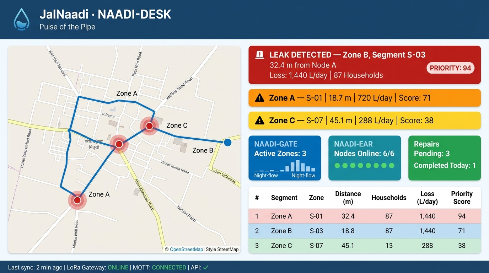
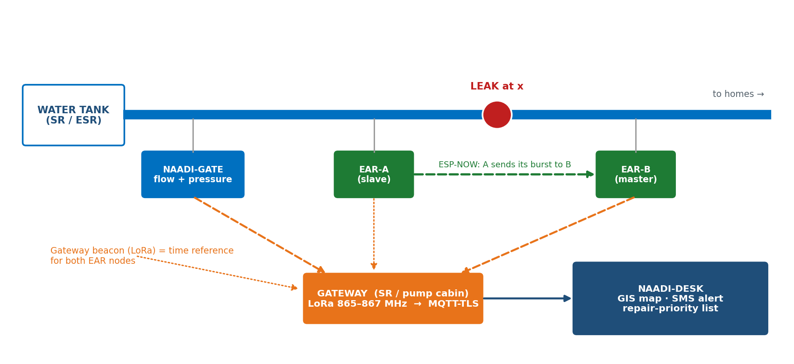
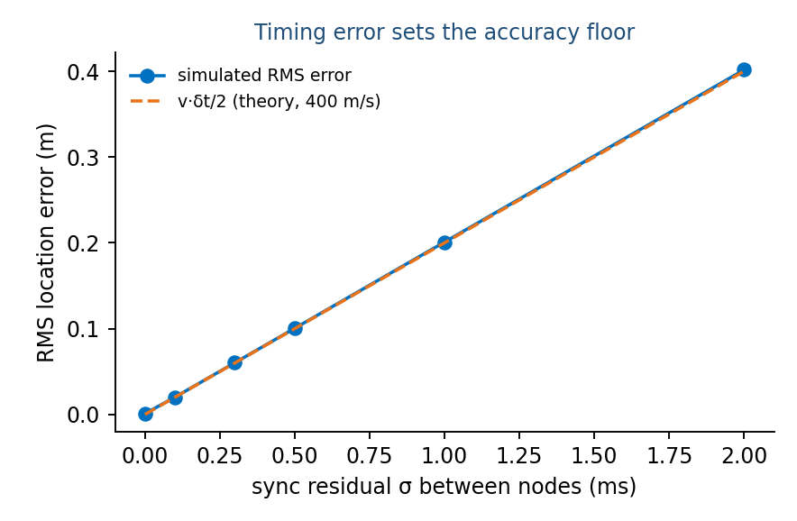
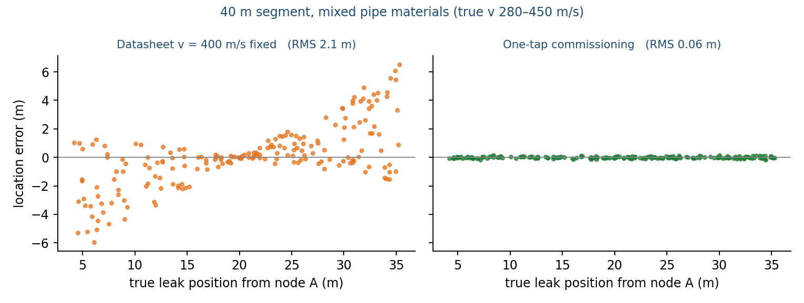

# JalNaadi — Listen first, locate next

**Smart India Hackathon 2026 · SIH26254 · Ministry of Jal Shakti (NJJM) · Hardware**
*Development of Indigenous Leak Detection Sensor Systems for Operation & Maintenance of Water Supply Pipelines*
Team **SolverX** (Team ID 128664)

JalNaadi ("pulse of the pipe") is a low-cost, solar-recharged system that **detects and locates leaks** in village and
small-town water pipelines. Jal Jeevan Mission flow and pressure sensors tell you **that** a zone is losing water;
JalNaadi tells you **where** the pipe is leaking.

> New here? Read [`docs/JalNaadi_Master_Explainer.pdf`](docs/JalNaadi_Master_Explainer.pdf) first — it explains the
> problem, the physics and the design from scratch.



> 🔩 **Hardware Prototype Visual** — open [`docs/hardware_prototype.html`](docs/hardware_prototype.html) in a browser for the full interactive hardware schematic, wiring map, BOM, and system architecture diagram.

## How it works

| Layer | Job | Method |
|---|---|---|
| **NAADI-GATE** | Which zone? | Mean zone inlet flow in the 02:00–04:00 window, compared with a learned night baseline (EWMA) and a CUSUM change detector |
| **NAADI-EAR** | Where in the zone? | Clamp-on MEMS vibration nodes wake on a gateway beacon, record a synchronised burst, classify it on the node (leak / pump / tap / quiet), exchange it inside the pair over ESP-NOW, and cross-correlate (GCC-PHAT): `x = (L − v·τ) / 2` |
| **NAADI-DESK** | Turn it into a repair | LoRa (865–867 MHz) → gateway → MQTT-TLS → FastAPI → map + SMS + repair ranking (litres/day × households) |

Key ideas: screen-then-locate · **One-Tap Commissioning** (`v = L/Δt` from a spanner tap, so no datasheet wave speed) ·
night-window listening · on-node leak-vs-pump-vs-tap classifier · repair-priority engine · NJJM-style JSON payload.



## Status — what is real today

| Component | Status |
|---|---|
| Idea, architecture, equations, power budget | Designed and calculated — see the explainer |
| Localisation (GCC-PHAT), sync sensitivity, one-tap calibration, quantisation study | **Simulated** in Python; 13 unit tests pass (`analysis/`) |
| GATE night-flow detector, on-node classifier | **Simulated** on synthetic data; unit tested |
| Backend (ingest, leak placement, priority ranking) | **Implemented and tested** in software (`backend/`) |
| Firmware (EAR / GATE / gateway) | **Reference skeletons**, not yet run on hardware (`firmware/`) |
| Lab rig, real recordings, measured accuracy | *To be built and measured* — results will be added to `docs/` |

Simulation results are not hardware measurements. They assume one non-dispersive wave, independent white noise and no echoes.

## Simulation highlights (`docs/simulation_results.json`)

* Timing sets the accuracy floor: error ≈ `v·δt/2` (0.3 ms sync residual → ≈ 0.06 m RMS at 400 m/s).
* One-Tap Commissioning matters: on a 40 m segment with unknown pipe material, a fixed 400 m/s gives ≈ 2.1 m RMS error; the tapped speed gives ≈ 0.06 m.
* Exchanging 8-bit or 4-bit samples inside the pair costs nothing in simulation.
* GATE flags a 0.2 m³/h (3.3 L/min) night-flow rise within about a night; ≈ 1 false alarm per 467 nights on the synthetic zone.

 

## Quick start

```bash
python -m venv .venv && source .venv/bin/activate        # Windows: .venv\Scripts\activate
pip install -r requirements.txt

cd analysis
pytest -q                                   # 13 tests
python simulate_localisation.py 200         # regenerates docs/images/sim_*.png and docs/simulation_results.json
python simulate_classifier_and_gate.py

cd ../backend
pytest -q                                   # end-to-end ingest -> alarm -> leak -> ranking
uvicorn app:app --reload                    # then open ../dashboard/index.html via the same host, or set API in the file
```

Locate a leak in three lines:

```python
from jalnaadi import dsp
tau, confidence = dsp.gcc_phat(a, b, fs=4000, max_tau_s=L / 200.0, n_seg=5)   # a, b: synchronised bursts from node A and B
x = dsp.locate(tau, L_m, v_ms)                                                  # metres from node A
```

## Repository map

```
analysis/    jalnaadi/ (dsp.py, nightflow.py, priority.py, payload.py), simulations, tests
backend/     app.py (FastAPI + SQLite), test_app.py
dashboard/   index.html (Leaflet map + repair list)
firmware/    ear_node/, gate_node/, gateway/   (reference skeletons)
hardware/    BOM.csv, wiring.md
docs/        master explainer PDF, diagrams, simulation figures and results
```

## Hardware (prototype)

ESP32-WROVER-E (PSRAM) · SX1276 LoRa (866 MHz) · ADXL345 (3.2 kHz) or ADXL355 (4 kHz, low noise) · 18650 + 1 W solar ·
IP67 case. Indicative node cost ≈ ₹3,000 (ADXL345) to ≈ ₹5,500 (ADXL355). Both nodes of a pair must use the same sensor
and sampling rate. See `hardware/BOM.csv` and `hardware/wiring.md`.

## Standards and sources

NJJM Technical Expert Committee Report on measurement & monitoring (2021) · PIB releases on JJM 2.0 and sensor-based IoT ·
MoHUA AMRUT 2.0 guidelines · DoT/WPC 865–867 MHz delicensing (GSR 564(E)). Full links in the explainer, Appendix B.
The payload layout (`gid / did / dty / dt / p`) is modelled on the NJJM reference payload; align field codes with the
latest NJJM specification before field use.

## Licence

MIT — see `LICENSE`.
